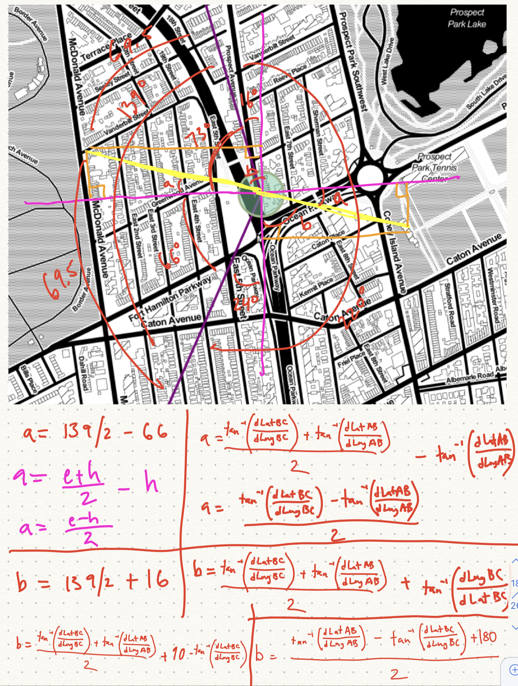

I realized that what I actually wanted were lines began and ended at points that were on a line that bisected the angle created by a station, the previous station, and the next station. This led to lots of math.

Beyond just calculating the bisector angles I had to worry about Latitude and Longitude to meter constants to adjust for the skew.

  

